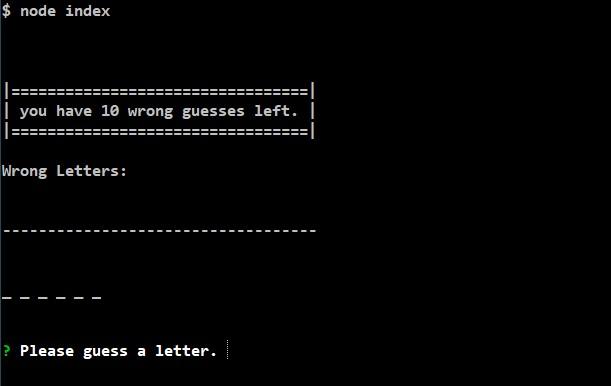
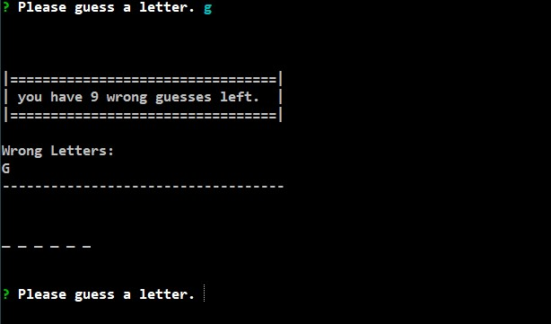
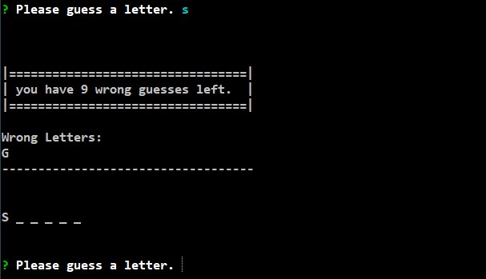
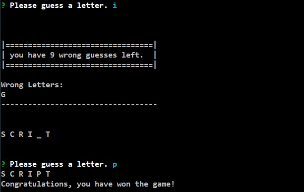

# Word-Guess-CLI

This is a Command Line Word Guessing Game. The User is prompted to guess a letter at the command line using the inquirer package. The word is chosed at random from a list of 5 words as of right now, but the list can be expanded to as many as needed. 

The initial prompt looks like this: 
  

  
The user enters a letter and presses <ENTER>. If the guess is incorrect, the wrong guesses counter is reduced by one and the letter is added to an array of incorrect guesses and is displayed for the player's reference. If the player inadvertantly guesses the letter again, it is not re-added to the array and the wrong guess does not count against the player. 
  

  
If the user guesses correctly, the wrong guesses counter remains the same, and the letter is displayed in the lower protion, replacing one of the underscore characters. 
  

  
Once the user has correctly guessed the word, the full word is displayed and a congratulatory message is displayed. 
  

  
If the player runs out of incorrect guesses, a message saying just that is displayed and the game is over. 